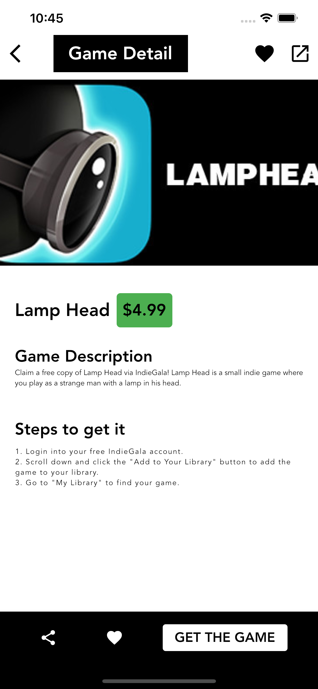

# Flutter BloC Game API

## Packages
  - equatable: ^2.0.3
  - flutter_bloc: ^8.0.1
  - freezed_annotation: ^1.1.0
  - glassmorphism: ^3.0.0
  - google_fonts: ^2.3.1
  - http: ^0.13.4
  - json_annotation: ^4.4.0
  - url_launcher: ^6.0.20
  - build_runner: ^2.1.8
  - freezed: ^1.1.1
  - json_serializable: ^6.1.5

## Screenshot

|  |  |  |
| ------------------------------------ | -------------------------------------- | -------------------------------------- |
